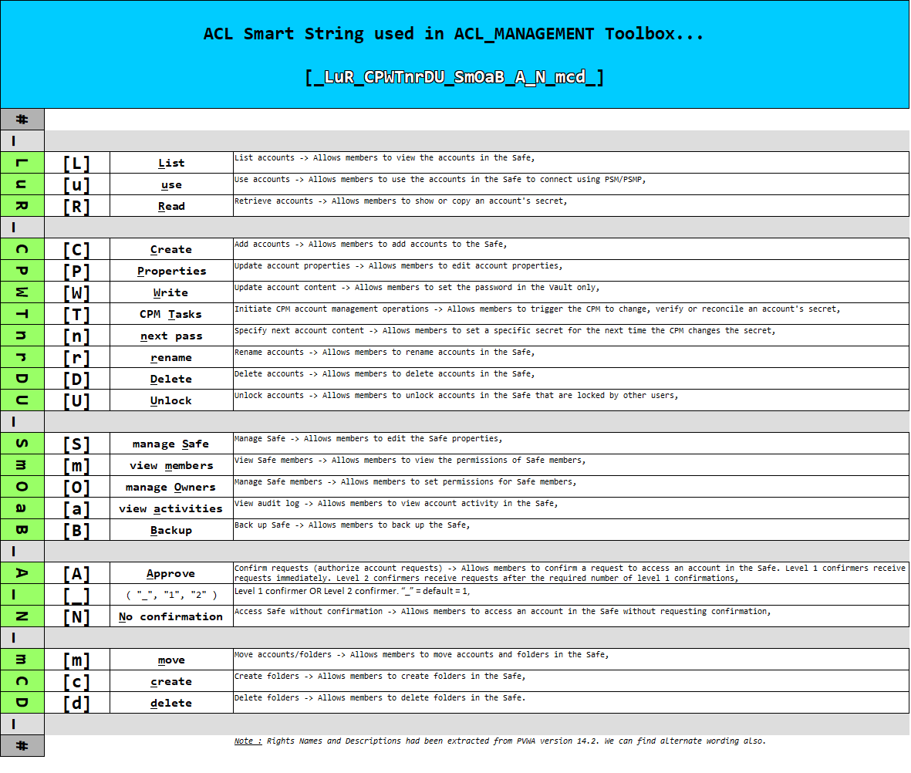
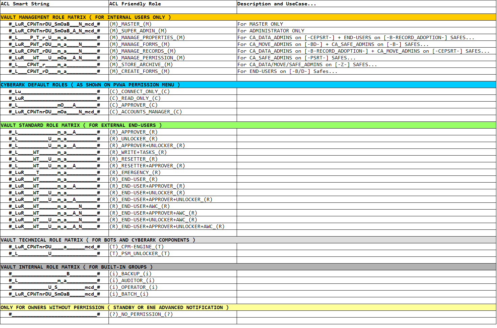

# 🚧 DRAFT VERSION 🚧
# UNDER REVIEW BY CYBERARK FUN CLUB COMMUNITY...

> **Status:** Draft documentation for review, corrections, and functional validation by CyberArk Fun Club members before wider publication.

---

# 🔐 ACL_MANAGEMENT (ToolBox)

## 📖 Overview

`ACL_MANAGEMENT (ToolBox)` is a lightweight and modular tool pack designed to support CyberArk Safe ACL extraction, normalization, visualization, and controlled remediation.

The ToolBox is intended to help with the following activities:

- Extract Safe ACLs from CyberArk PVWA through REST API.
- Normalize raw REST API permission data into a deterministic compact string format.
- Convert permission patterns into friendly role names.
- Review ownership and permissions in Excel through normalized Pivot Tables.
- Prepare controlled ACL updates or suppressions from reviewed data sets.
- Re-apply changes to Safes through dedicated refresh and suppression workflows.

This ToolBox is part of the **Krystal Vault Planet (KVP)** and **CyberArk Fun Club** community effort and is primarily intended for:

- Lab environments
- Quick assessment scenarios
- Governance and review workshops
- Controlled remediation preparations

---

## ️🏗️ Architecture Overview

The overall processing model is based on four major stages:

1. **Initialize a session** against one Vault context.
2. **Extract ACL data** and normalize it.
3. **Analyze the normalized data** in Excel through Office Scripts and Pivot Tables.
4. **Refresh or suppress ACLs** using reviewed TSV input files.

### Logical flow

```text
CyberArk PVWA REST API
        |
        v
$1_INIT_.cmd
        |
        v
$2_EXTRACT_ACL_.cmd
        |
        v
REST ACL --> ACL_SMART_STRING --> ACL_ROLE
        |
        v
[_<VAULT_CONTEXT>_]_OWNERS_ROLE_MATRIX_.tsv
        |
        +-----------------------------+
        |                             |
        v                             v
Excel / Office Scripts           $3_REFRESH_ACL_.cmd
(Pivot review & feedback)        $3_SUPPRESS_ACL_.cmd
        |                             |
        +-------------+---------------+
                      |
                      v
                  $4_TERM_.cmd
```

🔴 **SCREENSHOT PLACEHOLDER:** Add high-level architecture diagram here.

---

## 📁 Folder Structure

The ToolBox is organized into a modular sub-folder structure.

### 📦 `.\bin\`

This folder contains executables, DLL files, and PowerShell scripts used for extraction and refresh processing.

Typical contents include:

- PowerShell scripts used to call CyberArk PVWA REST API
- Supporting binaries
- Supporting DLL dependencies

This folder is the execution engine of the ToolBox.

### ⚙️ `.\cfg\`

This folder contains one configuration file per Vault environment.

Template configuration files are provided to simplify onboarding.

Each configuration file contains **three valid rows** plus optional comments starting with `#`.

The three operational parameters are:

1. `PVWA_URL`
2. `VAULT_CONTEXT`
3. `MATRIX_CONTEXT`

#### `PVWA_URL`

This parameter defines the REST API entry point, for example:

```text
https://<my-vault-web-portal>/PasswordVault
```

#### `VAULT_CONTEXT`

This parameter is used to prefix generated files, including:

- logs
- temporary files
- output files

This allows multiple extractions against multiple Vaults from the same workspace without naming conflicts.

#### `MATRIX_CONTEXT`

This parameter controls the ACL conversion logic.

The conversion sequence is:

```text
REST API ACL --> ACL_SMART_STRING --> ACL_ROLE
```

### 📚 `.\doc\`

This folder is currently empty.

It is reserved for future offline documentation, such as:

- one RTF / WordPad document for each primary command:
  - `INIT`
  - `EXTRACT`
  - `REFRESH`
  - `TERM`
- one document explaining the overall processing model and workspace organization
- one document describing installation and configuration
- one document describing quick test scenarios for basic validation

### 📝 `.\log\`

This folder is currently empty except for a placeholder file required to keep the folder in GitHub.

It is intended to store:

- execution logs
- debug logs

All generated log files are prefixed with `VAULT_CONTEXT`.

### 🧠 `.\sql\`

This folder contains LogParser SQL-like conversion logic.

These files are used to convert:

- REST API ACL output into `ACL_SMART_STRING`
- `ACL_SMART_STRING` into `ACL_ROLE`
- and the reverse path when refresh or suppression is performed

This folder is the normalization and reverse-conversion engine of the ToolBox.

### 🧪 `.\tmp\`

This folder is currently empty except for a placeholder file required to keep the folder in GitHub.

It is intended to store intermediate processing files generated during execution.

All generated temporary files are prefixed with `VAULT_CONTEXT`.

### 📊 `.\xls\`

This folder contains Office Scripts.

These scripts can be stored either:

- in OneDrive when shared usage is required
- or in the local `Office Scripts` area on the laptop when usage remains local

These scripts implement the visualization and feedback layer for the TSV outputs.

---

## Workspace Conventions

All main output files produced by extraction and all main input files consumed by refresh or suppression are stored at the **same level as the main command scripts**.

This keeps the execution model simple and makes manual review easier.

---

## ⚙️ Main Command Workflow

The ToolBox relies on a session-driven execution model:

```text
INIT --> EXTRACT --> REVIEW --> REFRESH or SUPPRESS --> TERM
```

### 🚀 `.\$1_INIT_.cmd`

This script initializes the session.

Main functions:

- prompts for the Vault configuration file name
- loads parameters from the selected configuration file
- authenticates to CyberArk PVWA REST API
- retrieves the authentication token

The script uses `curl` for PVWA connection and logon.

#### Recommended usage

When the target is **ACL extraction only**, best practice is to authenticate with an **Auditor** account.

Reason:

- the Auditor account is expected to be present on all Safes by design
- the Auditor account cannot normally be removed from Safe permissions
- this makes it a stable account for read-oriented extraction scenarios

### 📥 `.\$2_EXTRACT_ACL_.cmd`

This script performs Safe discovery, ACL extraction, consolidation, and conversion.

#### Main behavior

1. Prompts for a Safe filter.
2. The filter supports regular-expression style input similar to `FINDSTR /R`.
3. Calls PowerShell to extract the full Safe list.
4. Filters the Safe list.
5. Extracts ACLs Safe-by-Safe through PowerShell.
6. Concatenates the extracted ACL data.
7. Performs conversion to `ACL_SMART_STRING`.
8. Performs conversion from `ACL_SMART_STRING` to `ACL_ROLE`.

The conversion logic uses LogParser and the active `MATRIX_CONTEXT`.

#### Conversion fallback rule

If one `ACL_SMART_STRING` is **not** defined in the conversion matrix, the value is preserved **as-is**.

This prevents information loss and keeps unknown permission patterns visible.

#### Conversion-only mode

The script supports:

```text
-CONVERT-ONLY
```

This mode re-runs only the conversion steps:

- Step 1: REST API output to `ACL_SMART_STRING`
- Step 2: `ACL_SMART_STRING` to `ACL_ROLE`

This mode is useful when:

- the conversion matrix has been adjusted
- the transformation logic needs to be re-tested
- extraction does not need to be repeated

#### Output file

The main extraction output is:

```text
[_<VAULT_CONTEXT>_]_OWNERS_ROLE_MATRIX_.tsv
```

### 🔄 `.\$3_REFRESH_ACL_.cmd`

This script applies ACL additions or modifications.

#### Input file

```text
[_<VAULT_CONTEXT>_]_ROLE_MATRIX_#_REFRESH_#_.tsv
```

#### Main behavior

The refresh workflow performs the reverse transformation path compared to extraction:

```text
ACL_ROLE --> ACL_SMART_STRING --> REST API ACL
```

The script then applies adds or modifications to Safe member permissions.

#### Authentication requirement

For refresh operations, it is necessary to authenticate again with a privileged account such as:

```text
Administrator
```

In practice, the operator should re-run `\$1_INIT_.cmd` with a privileged account before launching refresh.

#### Conversion-only mode

The script also supports:

```text
-CONVERT-ONLY
```

This mode runs the reverse conversion logic without applying changes to the Vault.

It is useful for validation of:

- role mapping
- reverse transformation
- candidate refresh input files

### ❌ `.\$3_SUPPRESS_ACL_.cmd`

This script removes permissions.

#### Input file

```text
[_<VAULT_CONTEXT>_]_ROLE_MATRIX_#_SUPPRESS_#_.tsv
```

#### Main behavior

- uses a dedicated column layout different from refresh
- uses dedicated PowerShell logic for permission deletion
- performs reverse conversion where required before execution

#### Authentication requirement

Same as refresh: a privileged token is required.

This means the operator should re-run `\$1_INIT_.cmd` with a privileged account before launching suppression.

#### Conversion-only mode

The script also supports:

```text
-CONVERT-ONLY
```

This allows validation of the reverse-conversion pipeline without deleting permissions.

### 🔒 `.\$4_TERM_.cmd`

This script terminates the session.

Main functions:

- logs off from PVWA through `curl`
- clears command-shell variables
- resets the environment to prepare for another session or another Vault context

This helps keep the session model clean between runs.

---

## 🔁 ACL_SMART_STRING Model

`ACL_SMART_STRING` is the normalization format used by the ToolBox.

It provides a compact, readable, deterministic representation of the permissions attached to one Safe member.

### Current string format

The current format is represented as:

```text
#_LuR_CPWTnrDU_SmOaB_A_N_mcd_#
```

Each letter corresponds to one permission shown on the PVWA permission panel.

### Segment overview

The example above can be read as grouped permission zones:

```text
#_LuR_CPWTnrDU_SmOaB_A_N_mcd_#
```

Where the grouped meaning is:

- `LuR` = account access permissions
- `CPWTnrDU` = account management permissions
- `SmOaB` = Safe-level permissions
- `A` = approve requests permission
- `N` = no-confirmation permission
- `mcd` = folder-level permissions

### Permission reference

#### Account access permissions

- `L` = List
- `u` = Use
- `R` = Read

#### Account management permissions

- `C` = Create
- `P` = Properties
- `W` = Write
- `T` = CPM Tasks
- `n` = next pass
- `r` = rename
- `D` = Delete
- `U` = Unlock

#### Safe-level permissions

- `S` = manage Safe
- `m` = view_members
- `O` = manage Owners
- `a` = view activities
- `B` = Backup

#### Approval and access-control area

- `A` = Approve
- `_` = confirmation level placeholder or separator position
- `N` = No confirmation

#### Folder permissions

- `m` = move
- `c` = create
- `d` = delete

### Important note

Rights names and descriptions are aligned with wording extracted from PVWA version `14.2`, while alternate wording may exist in other versions.



---

## ACL Role Matrix

The ToolBox converts normalized permission strings into friendly role names.

This conversion is driven by the active `MATRIX_CONTEXT` and the relevant LogParser files.

### Main concept

The role-mapping model allows the operator to move from:

```text
low-level permission flags --> normalized ACL_SMART_STRING --> friendly ACL_ROLE
```

This makes pivoting, reviewing, grouping, and remediation preparation much easier.

### Examples of role families currently used

The current examples include several functional families, such as:

- Vault Management Role Matrix (for internal users only)
- CyberArk Default Roles (as shown on PVWA permission menu)
- Vault Standard Role Matrix (for external end-users)
- Vault Technical Role Matrix (for bots and CyberArk components)
- Vault Internal Role Matrix (for built-in groups)
- No-permission placeholder rows for special ownership cases

### Example role labels

Examples of friendly role labels currently visible in the provided matrix include:

```text
(M)_MASTER_(M)
(M)_SUPER_ADMIN_(M)
(M)_MANAGE_PROPERTIES_(M)
(C)_CONNECT_ONLY_(C)
(C)_READ_ONLY_(C)
(R)_END-USER_(R)
(R)_END-USER+UNLOCKER_(R)
(T)_CPM-ENGINE_(T)
(i)_AUDITOR_(i)
(?)_NO_PERMISSION_(?)
```

### Consistency rule

When the mapping logic is updated in the LogParser conversion file used for:

```text
ACL_SMART_STRING --> ACL_ROLE
```

then the reverse conversion file used for:

```text
ACL_ROLE --> ACL_SMART_STRING
```

must also be aligned.

This is required to preserve conversion reversibility.



---

## Excel Review Workflow

After extraction, the main TSV output can be reviewed in Excel.

Excel plus Office Scripts provides the visualization layer of the ToolBox.

### Step 1 — Import the TSV file into Excel

Import the main extraction output:

```text
[_<VAULT_CONTEXT>_]_OWNERS_ROLE_MATRIX_.tsv
```

Suggested workflow:

1. Open Excel.
2. Use **Data** > **From Text/CSV**.
3. Select the TSV file.
4. Confirm tab-separated parsing.
5. Load the content into a worksheet.

🔴 **SCREENSHOT PLACEHOLDER:** Add TSV import screen here.

### Step 2 — Run Office Script `ACL_MANAGEMENT_(1)_Format_Table.osts`

Purpose:

- normalize the imported sheet
- prepare the sheet as a structured table
- make the data ready for Pivot Table creation

### Step 3 — Run Office Script `ACL_MANAGEMENT_(2)_Create_PivTab.osts`

Purpose:

- build the normalized Pivot Table
- create an ACL review matrix from the imported data

🔴 **SCREENSHOT PLACEHOLDER:** Add Pivot Table creation result here.

### Step 4 — Run Office Script `ACL_MANAGEMENT_(3)_Refresh_PivTab.osts`

Purpose:

- refresh formatting after any Pivot update
- re-apply expected presentation rules

Recommended usage:

- assign the script to an Excel button for repeated use after refreshes

### Step 5 — Run Office Script `ACL_MANAGEMENT_(4)_Mark_Cells.osts` (optional)

Purpose:

- add marks, such as crosses, for manual review feedback
- support the visual review workflow developed for ACL validation

Recommended usage:

- assign the script to an Excel button
- use it on demand during review sessions

🔴 **SCREENSHOT PLACEHOLDER:** Add marked-cells example here.

### Step 6 — Run Office Script `ACL_MANAGEMENT_(5)_Color_Feedback.osts` (optional)

Purpose:

- add color feedback to selected areas
- optionally enrich the input data sheet with identifiable context

The current visual usage described includes adding or coloring:

- `SAFE`
- `MEMBER`
- `ACL_ROLE`

using colors such as:

- `YELLOW`
- `ORANGE`
- `BLUE`

Recommended usage:

- assign the script to an Excel button
- use it after Pivot refresh or as part of the review process

🔴 **SCREENSHOT PLACEHOLDER:** Add color-feedback example here.

---

## Office Scripts Summary

The currently referenced Office Scripts are:

```text
ACL_MANAGEMENT_(1)_Format_Table.osts
ACL_MANAGEMENT_(2)_Create_PivTab.osts
ACL_MANAGEMENT_(3)_Refresh_PivTab.osts
ACL_MANAGEMENT_(4)_Mark_Cells.osts
ACL_MANAGEMENT_(5)_Color_Feedback.osts
```

### Intended usage summary

- `ACL_MANAGEMENT_(1)_Format_Table.osts`
  - prepare imported TSV data
- `ACL_MANAGEMENT_(2)_Create_PivTab.osts`
  - generate normalized Pivot Table
- `ACL_MANAGEMENT_(3)_Refresh_PivTab.osts`
  - refresh and re-format Pivot Table
- `ACL_MANAGEMENT_(4)_Mark_Cells.osts`
  - add optional visual marks
- `ACL_MANAGEMENT_(5)_Color_Feedback.osts`
  - add optional color feedback and contextual enrichment

---

## Multi-Vault Design Considerations

A major design goal of the ToolBox is the ability to operate multiple Vault contexts from the same workspace.

This is mainly achieved through `VAULT_CONTEXT`, which prefixes:

- log files
- temporary files
- output files
- review input files

This minimizes collision risk and keeps execution traces separated.

---

## Operational Notes

- Extraction-only scenarios are ideally executed with an Auditor account.
- Refresh and suppression scenarios require a privileged account.
- Conversion-only modes are available on extraction, refresh, and suppression workflows.
- Unknown `ACL_SMART_STRING` values are preserved when missing from the conversion matrix.
- Reverse conversion files must always remain aligned with forward conversion files.

---

## Planned Documentation Extensions

The `doc` folder is reserved for future offline documents, including:

- command-level guides
- installation and configuration guide
- processing overview
- quick testing guide

This README can later be split or replicated in shorter companion documents if needed.

---

## Contribution and Review

This documentation is a **draft** and is intended to be reviewed by CyberArk Fun Club members.

Review topics may include:

- Markdown rendering quality
- role naming consistency
- conversion logic clarity
- script behavior accuracy
- screenshot selection and placement

---

## Suggested Screenshot Checklist

To finalize this README, the following screenshots are recommended:

1. architecture overview diagram
2. ACL Smart String description sheet
3. ACL role matrix example from lab data
4. TSV import screen in Excel
5. Pivot Table result
6. marked-cells example
7. color-feedback example

---

## Final Notes

The ToolBox is designed to remain lightweight, practical, and reusable.

Its strength comes from the combination of:

- REST API extraction
- deterministic normalization
- reversible role conversion
- Excel-based review workflow
- controlled remediation preparation

This makes it suitable for lab experimentation, quick governance reviews, and structured ACL preparation work.
